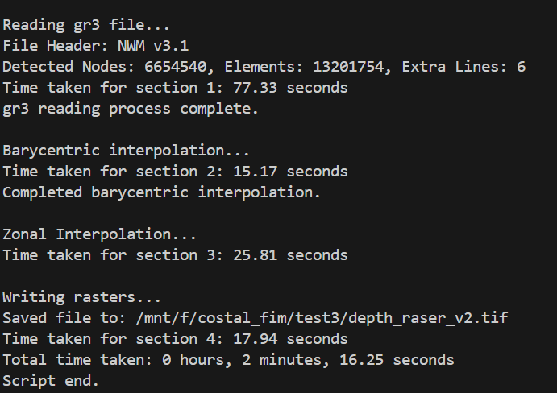
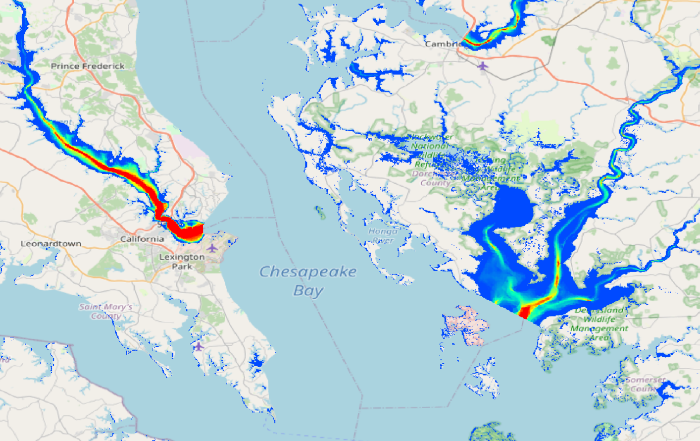

# Coastal-FIM


A Python package for implementing barycentric interpolation using DuckDB, specifically designed to compute SCHISM-derived depths on 30m grids. This tool provides an efficient, scalable solution for geospatial computations in large coastal domains.


---


## Table of Contents


- [Features](#features)
- [Installation](#installation)
- [Data](#data)
- [Usage](#usage)
- [Preprocessing Workflow](#preprocessing-workflow)
- [Testing](#testing)
- [Current Progress](#current-progress)
- [Report](#report)


---


## Features


1. **Efficient Barycentric Interpolation**: Leverages DuckDB for handling large-scale geospatial data efficiently.
2. **Leverages Preprocessed Data**: Preprocessed data from DEM, zonal coverage fraction, barycentric weight, and geosptial masks allows fast and effective interpolations.
3. **Efficient Storage**: Data is converted and stored in DuckDB that significantly reduces storage volume.
4. **Customizable Pipelines**: Modular structure allows easy adaptation to different datasets and use cases.


---


## Installation
This software requires a working anaconda/miniconda installation, please visit [miniconda page](https://docs.anaconda.com/miniconda/install/)


### Steps


1. Clone the repository:
   ```bash
   cd your_custom_path
   git clone https://github.com/owp-spatial/zonal-fim.git
   cd zonal-fim
   ```


2. Then the package can be installed via executing
    ```shell
    ./setup.sh
    ```


3. In the case there are permission issues execute
    ```shell
    chmod u+x setup.sh
    ```


### Environment


To activate pre-configured environment execute
```shell
conda activate coastal_fim_vis
```

---

## Data
Preprocessed sample data for Atlantic Gulf domain is:
```url
...
```

---

## Usage
   The script zonal_fim.py performs execution of pipeline for generating barycentric interpolation, generating masks, and preprocessing pipeline 

   
1. **Run the Barycentric Computation**:
    General pipeline for executing barycentric interpolation is given that a preprocessing has been done once, we can pass a new .gr3 or .nc file, the path to schisim_database.duckdb, and specify the output path. 
   
   `-i '/path/agGridfile.gr3'` or `-i '/path/nwm.t05z.analysis_assim_coastal.total_water.tm02.atlgulf.nc'`

    Ensure `--execute True`.
    
    There is an option `--zarr_format` to produce the outputs as zarr instead of a .tif file and one does not need to change .tif to .zarr in depth and wse inputs this conversion will be done automatically.  
    
    if `--generate_wse False` there is no need to specify a path got `-q`

    ```shell
    python zonal_fim.py --generate_mask False --preprocess False --generate_wse True --generate_depth True --zarr_format False  --execute True  --dissolve False -i '/path/nwm.nc' -c '/path/zonal_database.duckdb' -m '/path/depth_raser_v1.tif' -q '/path/wse_raser_v1.tif'
    ```
    A sample output of depth raster:

    
    

2. **Output**:
   - Barycentric interpolation is saved as depth table in the DuckDB database.
   - Can write WSE interpolation and depth values as .tif and .zarr file if specified. 

---

## Preprocessing Workflow

- visit  for preprocessing instructions


## Testing


### Test Cases


1. **Tampa Region**:
   - Executed entire process: **Pass**
2. **Atlantic and Gulf Domain**:
   - Executed all steps except coverage fraction interpolation: **Pass**
3. **Comparison with Linear Interpolation**:
   - Validated results against linear interpolation: **Pass**


---


## Current Progress


1. **Implemented**:
   - Barycentric computations.
   - Batch processing for DEM and zonal data.
2. **Next Steps**:
   - Function descriptions
   - Write comprehensive tests for the package.

---

## Report

Detailed documentation and implementation notes are available in the report:
[Report Link](https://docs.google.com/document/d/1DoPeE0IRVHkjqabqTUaX5aWCnPZn9Mdv/edit?usp=sharing&ouid=110666552849114372265&rtpof=true&sd=true)


---

