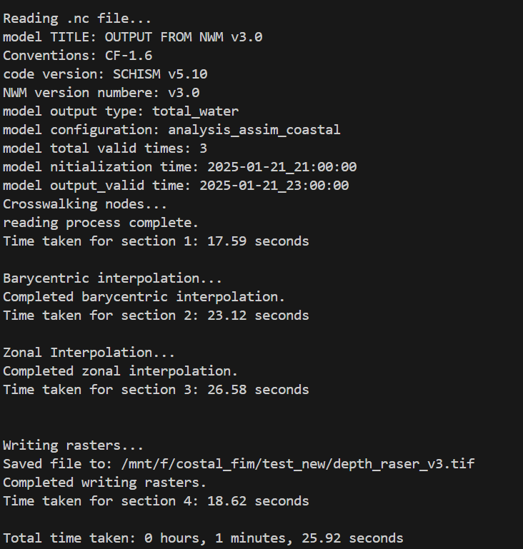

# Coastal-FIM:<a href="https://github.com/owp-spatial/zonal-fim.git"></a>

<!-- badges: start -->
[](https://github.com/owp-spatial/zonal-fim/actions/workflows/test.yml)
[](https://duckdb.org/)
[](https://ibis-project.org/)
<!-- badges: end -->

A Python package for implementing barycentric interpolation using DuckDB, specifically designed to compute SCHISM-derived depths on 30m grids. This tool provides an efficient, scalable solution for geospatial computations in large coastal domains.


---


## Table of Contents


- [Features](#features)
- [Installation](#installation)
- [Data](#data)
- [Usage](#usage)
- [Preprocessing Workflow](#preprocessing-workflow)
- [Testing](#testing)
- [Current Progress](#current-progress)
- [Report](#report)


---


## Features


1. **Efficient Barycentric Interpolation**: Leverages DuckDB for handling large-scale geospatial data efficiently.
2. **Leverages Preprocessed Data**: Preprocessed data from DEM, zonal coverage fraction, barycentric weight, and geosptial masks allows fast and effective interpolations.
3. **Efficient Storage**: Data is converted and stored in DuckDB that significantly reduces storage volume.
4. **Customizable Pipelines**: Modular structure allows easy adaptation to different datasets and use cases.


---


## Installation
This software requires a working anaconda/miniconda installation, please visit [miniconda page](https://docs.anaconda.com/miniconda/install/)


### Steps


1. Clone the repository:
   ```bash
   cd your_custom_path
   git clone https://github.com/owp-spatial/zonal-fim.git
   cd zonal-fim
   ```


2. Then the package can be installed via executing
    ```shell
    ./setup.sh
    ```


3. In the case there are permission issues execute
    ```shell
    chmod u+x setup.sh
    ```


### Environment


To activate pre-configured environment execute
```shell
conda activate coastal_fim_vis
```

---

## Data
Preprocessed data for Atlantic Gulf domain is:
```url
https://lynker-spatial.s3.us-west-2.amazonaws.com/tabular-resources/zonal_database.duckdb
```

---

## Usage
   The script zonal_fim.py performs execution of pipeline for generating barycentric interpolation, generating masks, and preprocessing pipeline 

   
1. **Run the Barycentric Computation**:
    General pipeline for executing barycentric interpolation is given that a preprocessing has been done once, we can pass a new .gr3 or .nc file, the path to schisim_database.duckdb, and specify the output path. 
   
   `-i '/path/agGridfile.gr3'` or `-i '/path/nwm.t05z.analysis_assim_coastal.total_water.tm02.atlgulf.nc'`

    Ensure `--execute True`.
    
    There is an option `--zarr_format` to produce the outputs as zarr instead of a .tif file and one does not need to change .tif to .zarr in depth and wse inputs this conversion will be done automatically.  
    
    if `--generate_wse False` there is no need to specify a path got `-q`

    ```shell
    python zonal_fim.py --generate_mask False --preprocess False --generate_wse True --generate_depth True --zarr_format False  --execute True  --dissolve False -i '/path/nwm.nc' -c '/path/zonal_database.duckdb' -m '/path/depth_raser_v1.tif' -q '/path/wse_raser_v1.tif'
    ```
    A sample output of depth raster:

    
    

2. **Masking**: 
   There are two ways to mask outputs of the zonal fim depth raster and both can be applied simultaneously or none at all:
   - Mask nodes based on their elevation profile: one can provide a certain elevation threshold to mask nodes form zonal computation (this does increase computational efficiency due masking of the nodes them selfs). There is an optional `--elevation_threshold` or `-et` argument that can be passed. </br></br>
   For example we can mask all node bellow sea level </br>
   ```shell
   python zonal_fim.py --generate_mask False --preprocess False --generate_wse True --generate_depth True --zarr_format False  --execute True  --dissolve False -et 0 -i '/path/nwm.nc' -c '/path/zonal_database.duckdb' -m '/path/depth_raser_v1.tif' -q '/path/wse_raser_v1.tif'
   ```

   - Mask generated depth raster: one can provide a certain depth threshold to mask certain depth values form zonal outputs. There is an optional `--depth_threshold` or `-dt` argument that can be passed. </br></br>
   For example we can mask depth values bellow 0.5 feet or 0.1524 m </br>
   ```shell
   python zonal_fim.py --generate_mask False --preprocess False --generate_wse True --generate_depth True --zarr_format False  --execute True  --dissolve False -dt 0.1524 -i '/path/nwm.nc' -c '/path/zonal_database.duckdb' -m '/path/depth_raser_v1.tif' -q '/path/wse_raser_v1.tif'
   ```

3. **low-memory option**:
   There is an optional low memory option (`--low_memory` or `-lm`) for execution of coastal FIM and generation of the maps that gives users control over resource management, allowing to adapt the workflow to different hardware constraints or performance goals. Setting this flag is highly recommanded. To Set low_memory falg: </br>
   ```shell
   python zonal_fim.py --generate_mask False --preprocess False --generate_wse True --generate_depth True --zarr_format False  --execute True  --dissolve False --low_memory True -i '/path/nwm.nc' -c '/path/zonal_database.duckdb' -m '/path/depth_raser_v1.tif' -q '/path/wse_raser_v1.tif'
   ```

4. **Output**:
   The script's final output can be delivered in one of three formats, controlled by the --output_format flag. This design provides flexibility, allowing you to either generate standard GIS files, create modern cloud-native data stores, or build high-performance in-memory data pipelines.

   `Note:` All intermediate calculations, such as the final interpolated depth and WSE values, are materialized as tables within the DuckDB database before being converted into the chosen output format so they can be used directly to generate any other file format.
   
   ***Option 1: Cloud Optimized GeoTIFF (--output_format 'COG')***
   It produces istandard raster files that can be used in any desktop GIS software or web mapping application. </br>
   What it Creates: </br>
   One or more .tif files (e.g., depth.tif, wse.tif). </br>
   Files are written in the Cloud Optimized GeoTIFF (COG) format. This is a special type of GeoTIFF that is structured for efficient access over networks. It contains internal tiling and overviews. </br>
   This is done by adding `--output_format 'COG'` </br>
   ```shell
   python zonal_fim.py --generate_mask False --preprocess False --generate_wse True --generate_depth True --zarr_format False  --execute True  --dissolve False --low_memory True  --output_format 'COG' -i '/path/nwm.nc' -c '/path/zonal_database.duckdb' -m '/path/depth_raser_v1.tif' -q '/path/wse_raser_v1.tif'
   ```
   
   ***Option 2: Zarr Store (--output_format 'ZARR')***
   This option creates a modern, high-performance, cloud-native data store. Zarr is a format designed for chunked, compressed, N-dimensional arrays, making it ideal for large-scale scientific computing and parallel processing. </br>
   What it Creates: </br>
   A directory on the file system (e.g., atlgulf_fim.zarr/). </br>
   Inside this directory, a new raster array is added for each model run and variable (e.g., nwm.t00z.analysis_wse, nwm.t00z.analysis_depth). </br>
   The store is append-friendly; running the script with a new input file will add new arrays to the existing Zarr store without overwriting previous results. </br>
   Use Case: </br>
   Building a centralized data store for many model runs. </br>
   Serving as a high-performance backend for data analysis with Python libraries like Xarray and Dask. </br>
   Providing a direct source for on-the-fly tile servers that can read chunked data efficiently. </br>
   This is done by adding `--output_format 'ZARR'` </br>
   ```shell
   python zonal_fim.py --generate_mask False --preprocess False --generate_wse True --generate_depth True --zarr_format False  --execute True  --dissolve False --low_memory True  --output_format 'ZARR' -i '/path/nwm.nc' -c '/path/zonal_database.duckdb' -m '/path/depth_raser_v1.tif' -q '/path/wse_raser_v1.tif'
   ```

   ***Option 3: In-Memory GDAL Datasets (--output_format 'IN_MEMORY')***
   This is an advanced option for developers building integrated Python data pipelines. Instead of writing any files to disk, the function creates the final rasters in RAM and returns them as GDAL Dataset objects. </br>
   What it Creates: </br>
   No files are written to disk. </br>
   The script's main function returns a Python dictionary where keys ('depth', 'wse') map to in-memory gdal.Dataset objects. Further develiopments can be made in continuation of the script to use in-memory array.</br>
   Use Case: </br>
   High-performance workflows where the raster data needs to be immediately passed to another Python function for further processing (e.g., calculating statistics, generating a map thumbnail, re-projecting, etc.). </br>
   Eliminating slow disk I/O when the final raster is only an intermediate step in a larger automated pipeline. </br>
   This is done by adding `--output_format 'IN_MEMORY'` </br>
   ```shell
   python zonal_fim.py --generate_mask False --preprocess False --generate_wse True --generate_depth True --zarr_format False  --execute True  --dissolve False --low_memory True  --output_format 'IN_MEMORY' -i '/path/nwm.nc' -c '/path/zonal_database.duckdb' -m '/path/depth_raser_v1.tif' -q '/path/wse_raser_v1.tif'
   ```
---

## Preprocessing Workflow

- visit [preprocessing folder](preprocesing/README.md) for preprocessing instructions


## Testing


### Test Cases


1. **Tampa Region**:
   - Executed entire process: **Pass**
2. **Atlantic and Gulf Domain**:
   - Executed all steps except coverage fraction interpolation: **Pass**
3. **Comparison with Linear Interpolation**:
   - Validated results against linear interpolation: **Pass**


---


## Current Progress


1. **Implemented**:
   - Barycentric computations.
   - Batch processing for DEM and zonal data.
2. **Next Steps**:
   - Function descriptions
   - Write comprehensive tests for the package.

---

## Report

Detailed documentation and implementation notes are available in the report:
[Report Link](https://docs.google.com/document/d/1DoPeE0IRVHkjqabqTUaX5aWCnPZn9Mdv/edit?usp=sharing&ouid=110666552849114372265&rtpof=true&sd=true)


---

