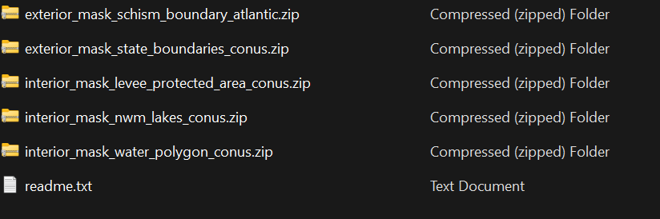

# This subdirectory contains the preproccing steps file for the project.

**This list all single time preprocessing steps required for a particular domain**

## Table of Contents

- [Step1](#step1)
- [Step2](#step2)
- [Step3](#step3)

---

## Step1

The first step is to generate an overall mask using a set of different masks and the following procedure
        
It implements the following 5 step masking logic

1. "mask_schism_boundary_atlantic.shp","exterior"
2. "mask_state_boundaries_conus.shp","exterior"
3. "mask_levee_protected_area_conus.shp","interior"
4. "mask_nwm_lakes_conus.shp","interior"
5. "mask_water_polygon_conus.shp","interior" 

A sample of folder path containing different masks:



This can be achieved by executing zonal_fim.py and activating generate_mask flag while other flags are set to `False` also one can alter the name of masks shapefile names in case they have changed by these flags:

--water_table_name <br>
--nwm_table_name <br>
--levee_table_name <br>
--state_table_name <br>
--schisim_table_name <br>

Several paths must be specified including:

-k '/path/shape_file_folder' that is the folder path where the schisim element shape file lives <br>
-l '/path/output_elements_folder' that is the folder path where the schisim element parquet and geopackage will be saved to <br>
-a '/path/masks.duckdb' path to the mask database that will store the generated overall mask <br>

and there is an optional item to dissolve all geometries into a single multi-polygon feature that can be set but recommend the default `True` value

--dissolve

```shell
python zonal_fim.py --generate_mask True --preprocess False --generate_wse False --generate_depth False --zarr_format False  --execute False  --dissolve True -k '/path/shape_file_folder' -l '/path/output_elements_folder' -a '/path/masks.duckdb' -p 'exterior_mask_schism_boundary_atlantic_buffer_atlgulf' -n 'exterior_mask_state_boundaries_conus_atlgulf' -x 'interior_mask_levee_protected_area_conus_atlgulf' -t 'interior_mask_nwm_lakes_conus_atlgulf' -f 'interior_mask_water_polygon_conus_atlgulf'
```


---


## Step2
Next step is to generate coverage fractions from zonal in R

This step requires:
1. the ElementPolygons.gpkg file generated from preprocessing step 1 <br>
2. A TB DEM grid <br>

The following two steps needed to generate cell coverage fractions:
1. Write the mask file to .gpkg 
    By executing the `generate_zonal_req.ipynb` we add the mask layer to the `ElementPolygons.gpkg`

2. Generate coverage-fraction and elevation values for all cells 
    The `weights_mask_elev_table.R` file then does the following

    1.  Takes the triangles and TB dataset to compute the relative coverage fraction of each cell and polygon ID. <br>
    2.  For each cell, the cell the area is determined as mask or not, and an elevation is assigned

    The result is a table that contains the following columns:

    ```r
    > head(fin)
        pg_id      cell coverage_fraction elevation  mask
        <num>     <num>             <num>     <num> <num>
    1: 122881 720766867       0.023299048  5.497267    NA
    2: 122881 720801591       0.552611947  5.367274    NA
    3: 122881 720801592       0.040903941  5.823075    NA
    4: 122881 720836314       0.006548808  4.383194    NA
    5: 122881 720836315       0.748685956  4.613204    NA
    6: 122881 720836316       0.334290981  4.148118    NA
    ```


---    


## Step3
Final step in preprocessing is to generate barycentric weights for all none-masked schisim node. This can be done by calling the script with the following configuration.

Setting all flags to `False` except for <br>
--preprocess True <br>

```shell
python zonal_fim.py --generate_mask False --preprocess True --generate_wse False --generate_depth False --zarr_format False  --execute False -u '/path/ElementPolygons.parquet' -o '/path/TBDEM_AtlanticGulf_Mosaic_NWM_3_Revised_v4_COG.tif' -i '/path/agGridfile.gr3' -c '/path/schisim_database.duckdb' -w '/path/coverage_fraction.parquet'
```
---   